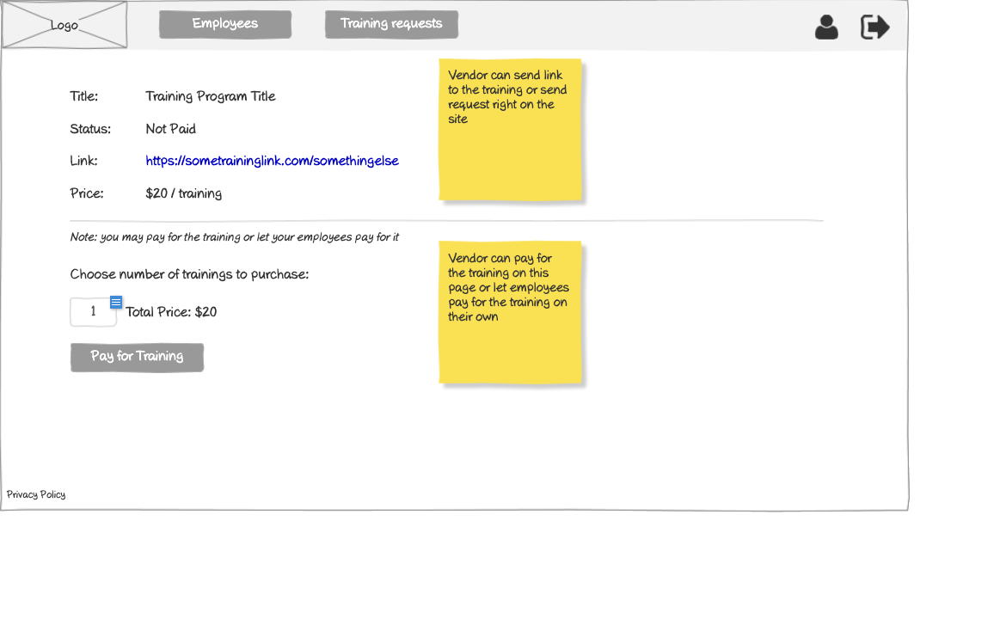

# Vendor - Training Information Wireframe

## Overview

This wireframe displays the "Training Information" interface from the vendor perspective. It shows details about a specific training program, including pricing and payment options, allowing vendors to purchase or manage training for their employees.

## UI Components

### Navigation Header
- **Logo**: Organization or application logo in the top-left corner
- **Main Navigation**: Horizontal menu with options for Employees and Training requests
- **User Profile**: Icon in the top-right corner for accessing user account options
- **Navigation Arrow**: Button in the top-right corner for additional navigation options

### Training Information Section
- **Title Field**: Static text showing the training program title
- **Status Field**: Status indicator showing "Not Paid" for this training
- **Link Field**: Hyperlink to the training content (https://sometraininglink.com/somethingelse)
- **Price Field**: Cost information showing "$20 / training"

### Purchase Options
- **Informational Note**: Text explaining "Note: you may pay for the training or let your employees pay for it"
- **Quantity Selector**: Input field to choose number of trainings to purchase
- **Total Price**: Dynamic calculation showing the total cost based on quantity
- **Pay for Training Button**: Button to proceed with payment

### Informational Notes
- **Yellow Sticky Note 1**: "Vendor can send link to the training or send request right on the site"
- **Yellow Sticky Note 2**: "Vendor can pay for the training on this page or let employees pay for the training on their own"

### Additional Information
- **Privacy Policy**: Link at the bottom-left of the page

## Functionality

This interface allows vendors to:

1. **View Training Details**: See information about the training program, including title, status, and price
2. **Access Training Content**: Use the provided link to view or access the training materials
3. **Purchase Multiple Licenses**: Select the quantity of training licenses to purchase
4. **See Total Cost**: View the calculated total price based on the selected quantity
5. **Complete Payment**: Pay for the selected number of training licenses
6. **Understand Options**: Learn about alternative payment approaches (vendor pays vs. employee pays)

## Notes

- The interface provides a straightforward way for vendors to purchase training for their employees
- The current status is "Not Paid," indicating this training has not yet been purchased
- The price is shown as $20 per training, with the ability to purchase multiple licenses at once
- The sticky notes explain important options available to vendors:
  1. They can either share the training link directly or send a request through the system
  2. They have flexibility in payment options, either paying themselves or allowing employees to pay individually
- This screen likely serves as both an informational view and a purchasing gateway
- The simple quantity selector and total price calculation make the purchasing process transparent
- This view is probably accessed from a training catalog or list of available training programs
