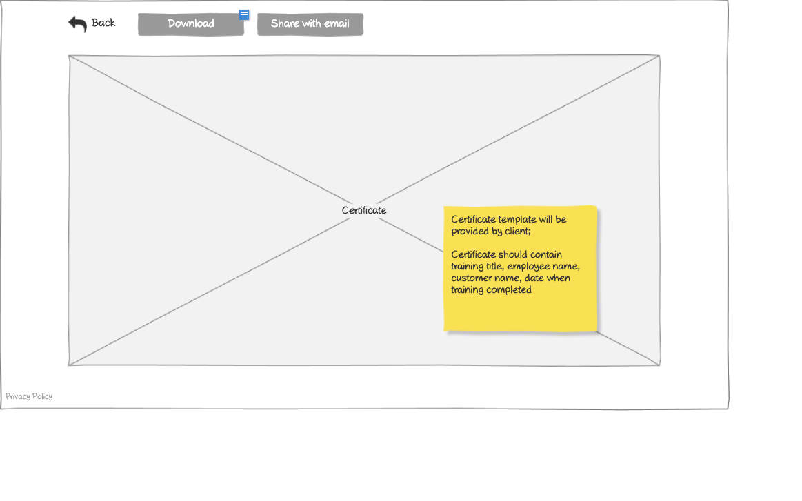

# Vendor - View Certificate Wireframe



## Image Preview


## ASCII Representation

```
+------------------------------------------------------+
|                                                      |
|  +----+   +---------+   +----------------+           |
|  |Back|   |Download |   |Share with email|           |
|  +----+   +---------+   +----------------+           |
|                                                      |
|                                                      |
|                                                      |
|                                                      |
|                                                      |
|                                                      |
|                                                      |
|                                                      |
|                  +------------+                      |
|                  | Certificate|                      |
|                  +------------+                      |
|                                                      |
|                                                      |
|                                                      |
|                                                      |
|                                                      |
|                                                      |
|                                                      |
|                                                      |
|                                                      |
|                                                      |
| Privacy Policy                                       |
+------------------------------------------------------+
```

## Overview

This wireframe displays the "View Certificate" interface from the vendor perspective. It shows a training certificate that has been issued to an employee, with options for downloading and sharing the certificate.

## UI Components

### Action Controls
- **Back Button**: Button in the top-left corner to return to the previous screen
- **Download Button**: Button to download the certificate as a file (likely PDF)
- **Share with email Button**: Button to share the certificate via email

### Certificate Display
- **Certificate Content**: Large central area displaying the actual certificate with its formal design
- **Certificate Label**: Text in the center indicating "Certificate"

### Informational Note
- **Yellow Sticky Note**: Contains important information about the certificate template (not visible in ASCII representation but likely present in the actual wireframe)

### Additional Information
- **Privacy Policy**: Link at the bottom-left of the page

## Functionality

This interface allows vendors to:

1. **View Certificate Details**: See the full certificate with all relevant information
2. **Download Certificate**: Save a copy of the certificate for record-keeping
3. **Share Certificate**: Send the certificate to others via email
4. **Navigate Back**: Return to the previous screen (likely the certificates list)

## Notes

- The certificate appears to be displayed in a large, central viewing area that dominates the screen
- The interface follows a minimalist design with focus on the certificate itself
- The action buttons are positioned at the top of the screen for easy access
- The certificate likely contains important information such as:
  - Training title
  - Employee name
  - Customer name
  - Completion date
- This view is likely accessed from the certificates list or other certificate management screens
- The certificate is presented in a placeholder format in the wireframe, with the actual design to be provided by the client
- The simple layout ensures that the certificate is the focal point of the interface
- This view is identical to the customer and employee view certificate interfaces, maintaining consistency across user roles
- The certificate viewing functionality is a critical part of the training workflow, as it represents the formal recognition of completed training
